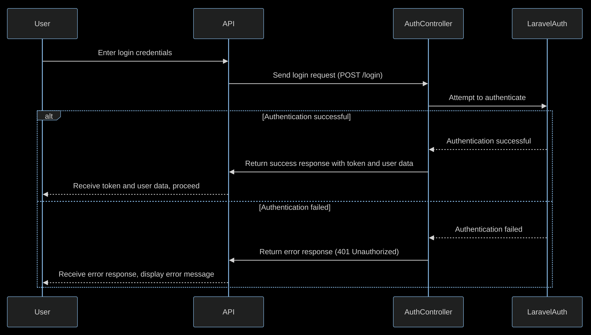

# Challenge PREX Julien Wolin

## Acerca del proyecto
El presente proyecto consiste en una API REST que consume un servicio de terceros ( [GIPHY](https://www.giphy.com/) ) e implementa los siguientes servicios:
- Login
- Buscar GIFS   
- Buscar GIF por ID
- Guardar GIF favorito

Además, proporciona la documentación necesaria para la instalación, preparación de datos de prueba y comprensión del funcionamiento del sistema.

## Tecnologías empleadas

- [PHP 8.3](https://www.php.net/downloads.php#v8.3.8).
- [Laravel 10](https://laravel.com/).
- [MySQL](https://www.mysql.com/).
- [UML](https://www.uml.org/).
- [Docker](https://www.docker.com/).


## Guía de Instalación y Configuración


### 1. Clonar el repositorio:
```bash
git clone hhttps://github.com/wj-004/prex_julien.git
cd prex_julien
```

### 2. Instalar las dependencias del proyecto:
```bash
composer install
```

### 3. Crear el archivo .env del proyecto a partir del archivo de ejemplo .env.example.
```bash
cp .env.example .env
```

### 4. Configurar las variables de entorno:
- GIPHY_API_KEY: necesaria para consumir los servicios de GIPHY 
- PASSPORT_TOKEN_EXPIRATION: Establece el tiempo de expiración del token (en minutos).
- PASSPORT_REFRESH_TOKEN_EXPIRATION: Establece cada cuantos días expira el refresh token.
```bash
GIPHY_API_KEY
PASSPORT_TOKEN_EXPIRATION
PASSPORT_REFRESH_TOKEN_EXPIRATION
``` 


### 5. Iniciar el servicio de Laravel Sail:  
Utilizar el paquete oficial Laravel Sail para manejo de Docker. Si no tiene configurada la opción "sail" utilizar "./vendor/bin/sail"  
```bash
sail up
```
* Opcional: Levantar el servicio de Laravel Sail en segundo plano:
```bash
sail up -d
```

### 6. Generar la Clave de la Aplicación:
```bash
sail artisan key:generate
```


### 7. Ejecutar las Migraciones y Seeders:
```bash
sail artisan migrate --seed
```

### 8. Instalar y configurar Passport
```bash
sail artisan passport:install
```


## Uso de la API REST  
### Endpoints de Servicios GIF

| Método | Endpoint                 | Descripción           
|--------|--------------------------|----------------------
| POST   |  /api/gifs               | Buscar GIFs           
| GET    |  /api/gifs/{id}          | Buscar GIF por ID
| POST   |  /api/gifs/add-bookmark  | Guardar GIF favorito  

<hr>


|**Login**|  
|-|
- Entrada

|Parámetro	| Tipo	    |Descripción	        | Requerido |
|-----------|-----------|-----------------------|-----------|
|QUERY	    |cadena	    | Filtro de consulta	| Sí
|LIMIT	    |numérico	| Límite de resultados	| No
|OFFSET	    |numérico	| Desplazamiento	    | No

- Salida:

| Tipo      |	Descripción                 |
|-----------|-------------------------------|
| Colección |	Resultados de la búsqueda   |



<hr>

|**Buscar GIFs**|
|-|

- Entrada:

|Parámetro	| Tipo	    |Descripción	        | Requerido |
|-----------|-----------|-----------------------|-----------|
|ID	        |cadena	    | Identificador del GIF	| Sí        |

- Salida:

| Tipo      |	Descripción                 |
|-----------|-------------------------------|
| Colección |	Resultados de la búsqueda   |


Tipo	Descripción
Datos	Datos del recurso consultado
Tabla: Buscar GIF por ID
Método	Endpoint	Descripción
GET	/api/gifs/{id}	Obtener información de un GIF específico
Entrada:

Parámetro	Tipo	Descripción	Requerido
GIF_ID	numérico	Identificador del GIF	Sí
Salida:

Tipo	Descripción
Datos	Datos del recurso consultado
Tabla: Guardar GIF Favorito
Método	Endpoint	Descripción
POST	/api/gifs/favorite	Guardar un GIF como favorito
Entrada:

Parámetro	Tipo	Descripción	Requerido
GIF_ID	numérico	Identificador del GIF	Sí
ALIAS	cadena	Alias del GIF	Sí
USER_ID	numérico	Identificador del usuario	Sí
Salida:

Tipo	Descripción
Datos	Confirmación de guardado exitoso


### Endpoints de Autenticación**

| Método | Endpoint                 | Descripción           
|--------|--------------------------|----------------------
| POST   |  /api/register           | Registro de usuario           
| POST   |  /api/login              | Inicio de sesión
| POST   |  /api/logout             | Terminar sesión  


<p align="center"><a href="https://laravel.com" target="_blank"></a></p>


