# Challenge PREX Julien Wolin

## Acerca del proyecto
El presente proyecto consiste en una API REST que consume un servicio de terceros ( [GIPHY](https://www.giphy.com/) ) e implementa los siguientes servicios:
- Login
- Buscar GIFS   
- Buscar GIF por ID
- Guardar GIF favorito

Además, proporciona la documentación necesaria para la instalación, preparación de datos de prueba y comprensión del funcionamiento del sistema.

## Tecnologías empleadas

- [PHP 8.2](https://www.php.net/downloads.php#v8.2.10).
- [Laravel 10](https://laravel.com/).
- [MySQL](https://www.mysql.com/).
- [UML](https://www.uml.org/).
- [Docker](https://www.docker.com/).


## Guía de Instalación y Configuración


### 1. Clonar el repositorio:
```bash
git clone https://github.com/wj-004/prex_julien.git
cd prex_julien
```

### 2. Instalar las dependencias del proyecto:
```bash
composer install
```

### 3. Crear el archivo .env del proyecto a partir del archivo de ejemplo .env.example.
```bash
cp .env.example .env
```

### 4. Configurar las variables de entorno:
- GIPHY_API_KEY: necesaria para consumir los servicios de GIPHY 
- PASSPORT_TOKEN_EXPIRATION: Establece el tiempo de expiración del token (en minutos).
- PASSPORT_REFRESH_TOKEN_EXPIRATION: Establece cada cuantos días expira el refresh token.
```bash
GIPHY_API_KEY
PASSPORT_TOKEN_EXPIRATION
PASSPORT_REFRESH_TOKEN_EXPIRATION
``` 


### 5. Iniciar el servicio de Laravel Sail:  
Utilizar el paquete oficial Laravel Sail para manejo de Docker. Si no tiene configurada la opción "sail" utilizar "./vendor/bin/sail"  
```bash
sail up
```
* Opcional: Levantar el servicio de Laravel Sail en segundo plano:
```bash
sail up -d
```

### 6. Generar la Clave de la Aplicación:
```bash
sail artisan key:generate
```


### 7. Ejecutar las Migraciones y Seeders:
```bash
sail artisan migrate --seed
```

### 8. Instalar y configurar Passport
```bash
sail artisan passport:install
```


## Uso de la API REST  
### Endpoints de Servicios GIF

| Método | Endpoint                 | Descripción           
|--------|--------------------------|----------------------
| POST   |  /api/gifs/search        | Buscar GIFs           
| GET    |  /api/gifs/get-by-id/{id}| Buscar GIF por ID
| POST   |  /api/gifs/add-bookmark  | Guardar GIF favorito  


### Endpoints de Autenticación

| Método | Endpoint                 | Descripción           
|--------|--------------------------|----------------------
| POST   |  /api/register           | Registro de usuario           
| POST   |  /api/login              | Inicio de sesión
| POST   |  /api/logout             | Terminar sesión  


<hr>

## Documentación de Servicios


## Casos de Uso
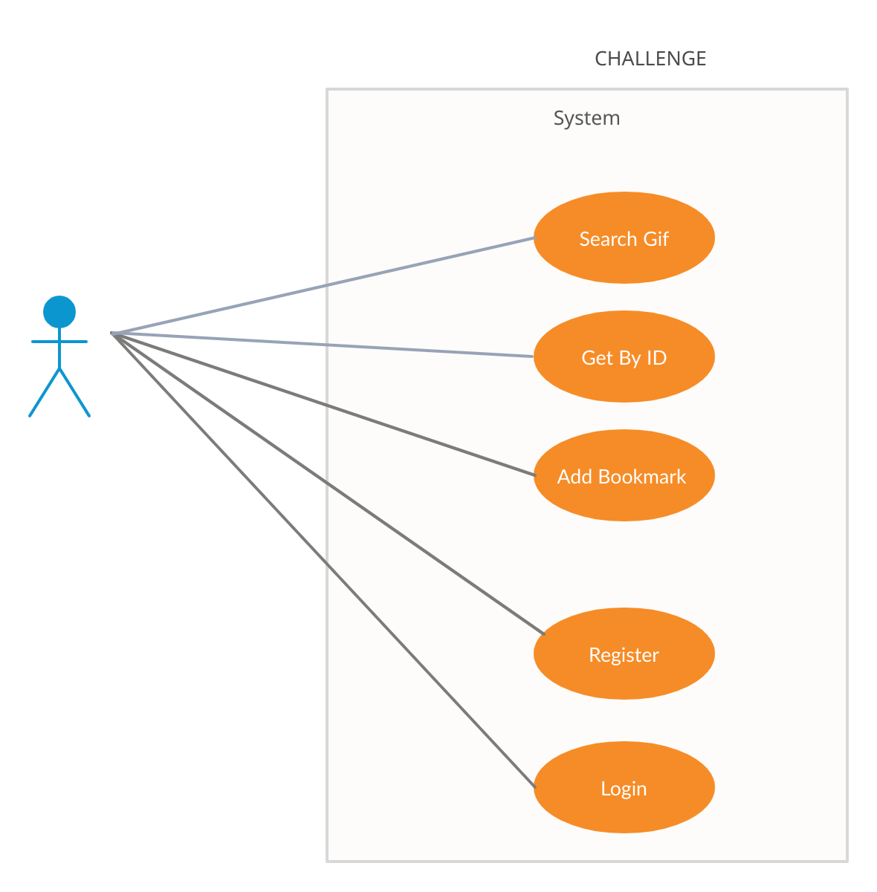


### Buscar GIFs

|ENDPOINT: | /api/gifs/search |
|-|-|

|ENTRADA:|
|-|

|Parámetro	| Tipo	    |Descripción	        | Requerido |
|-----------|-----------|-----------------------|-----------|
|QUERY	    |cadena	    | Filtro de consulta	| Sí
|LIMIT	    |numérico	| Límite de resultados	| No
|OFFSET	    |numérico	| Desplazamiento	    | No

|SALIDA:|
|-|

| Tipo      |	Descripción                 |
|-----------|-------------------------------|
| Colección |	Resultados de la búsqueda   |

|Diagrama de Secuencia:|
|-|

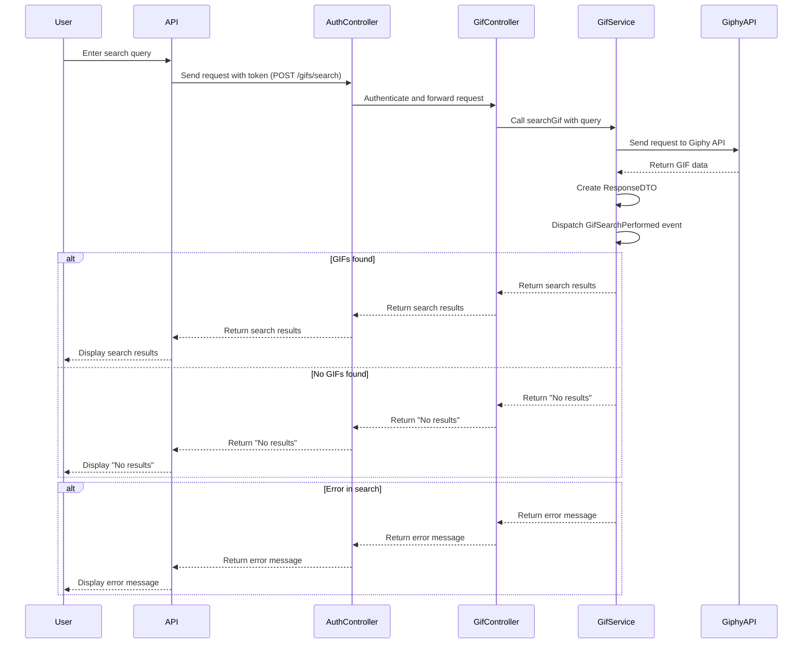
<hr>

### Buscar GIF por ID

|ENDPOINT: | /api/gifs/get-by-id/{id} |
|-|-|

|ENTRADA:|
|-|

|Parámetro	| Tipo	    |Descripción	        | Requerido |
|-----------|-----------|-----------------------|-----------|
|ID	        |cadena	    | Identificador del GIF	| Sí        |

|SALIDA:|
|-|

| Tipo      |	Descripción                 |
|-----------|-------------------------------|
| Colección |	Datos del recurso consultado|

|Diagrama de Secuencia:|
|-|

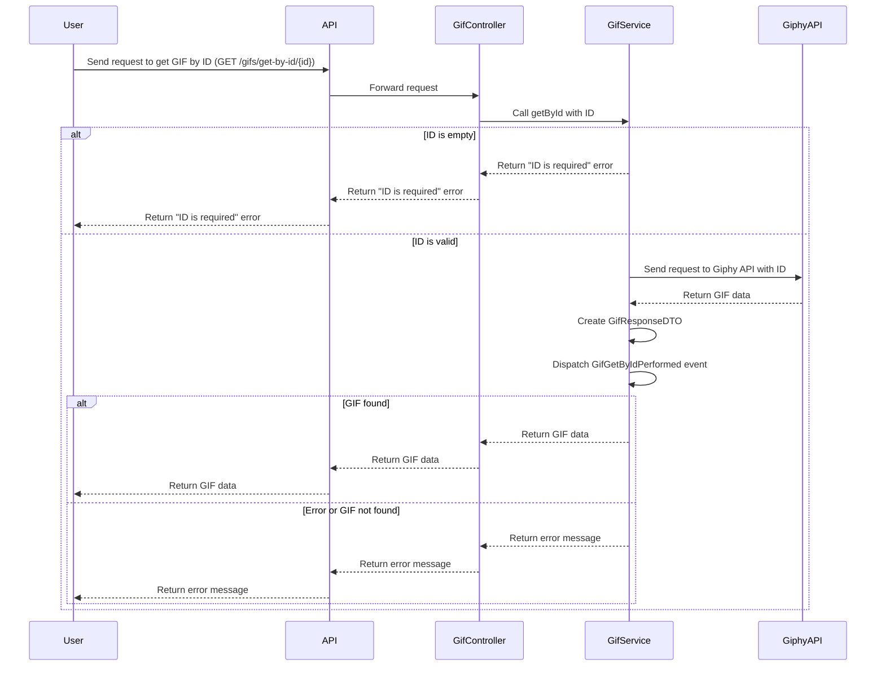

<hr>


### Guardar GIF Favorito

|ENDPOINT: | /api/gifs/add-bookmark |
|-|-|

|ENTRADA:|
|-|

|Parámetro	| Tipo	    |Descripción	            | Requerido |
|-----------|-----------|---------------------------|-----------|
| GIF_ID    | cadena    | Identificador del GIF	    | Sí        |
| ALIAS	    | cadena	| Alias del GIF	            | Sí        |
| USER_ID	| numérico	| Identificador del usuario | Sí        |

|SALIDA:|
|-|

| Tipo      |	Descripción                       |
|-----------|-------------------------------------|
| Datos     |	Confirmación de guardado exitoso  |

|Diagrama de Secuencia:|
|-|

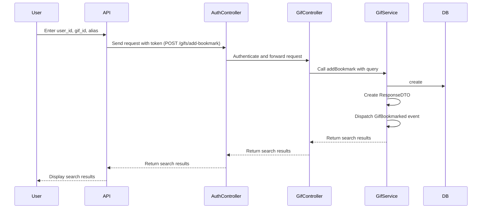
<hr>


### Servicios de Log
El proyecto hace uso de Events y Listeners para registrar toda la interacción con los servicios de la API.

|Diagrama de Secuencia:|
|-|

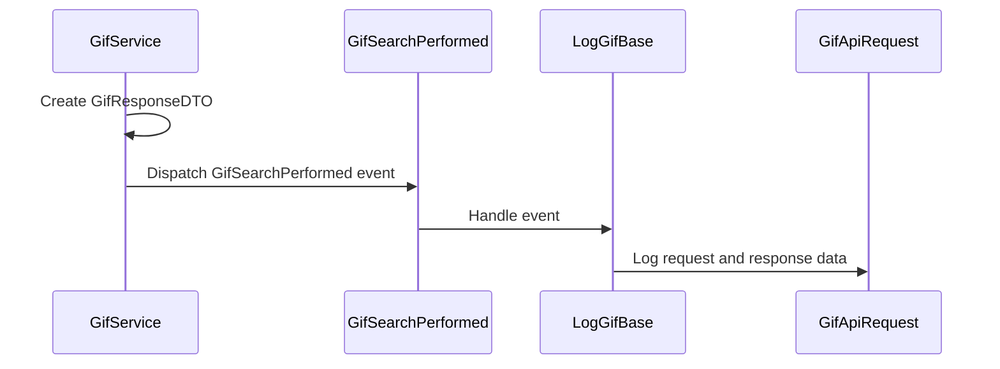

<hr>


### Secuencia completa Search con log:

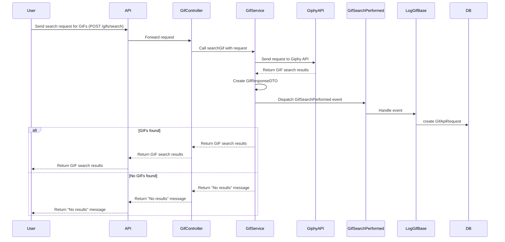

### Secuencia completa GetById con log:
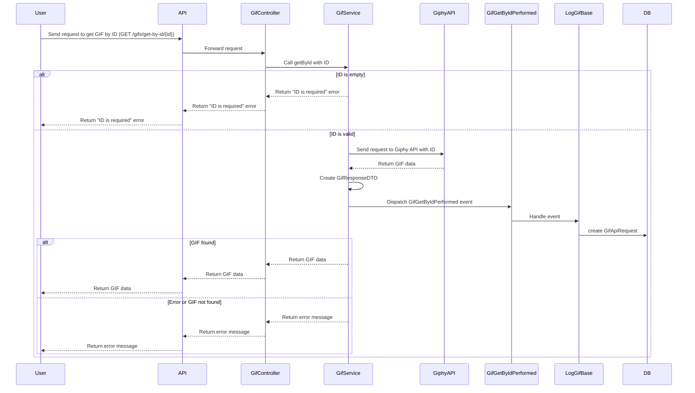

<hr>


### Registrar Usuario

|ENDPOINT: | /api/register |
|-|-|

|ENTRADA:|
|-|

|Parámetro	| Tipo	    |Descripción	            | Requerido |
|-----------|-----------|---------------------------|-----------|
| name      | cadena    | Nombre de usuario 	    | Sí        |
| email	    | cadena	| Correo electrónico        | Sí        |
| password	| cadena	| Contraseña                | Sí        |
| password	| cadena	| Contraseña                | Sí        |

|SALIDA:|
|-|

| Tipo      |	Descripción                       |
|-----------|-------------------------------------|
| Datos     |	Confirmación de registro exitoso  |

|Diagrama de Secuencia:|
|-|

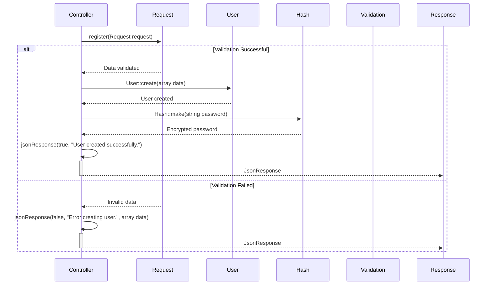

<hr>


### Login

|ENDPOINT: | /api/login |
|-|-|

|ENTRADA:|
|-|

|Parámetro	| Tipo	    |Descripción	        | Requerido |
|-----------|-----------|-----------------------|-----------|
| email     | cadena    | Email de usurio	    | Sí        |
| password  | cadena	| Contraseña del usuario| Sí        |

|SALIDA:|
|-|

| Tipo      |	Descripción                       |
|-----------|-------------------------------------|
| Datos     |	Confirmación de ingreso           |
| Datos     |	Token de ingreso                  |


|Diagrama de Secuencia:|
|-|

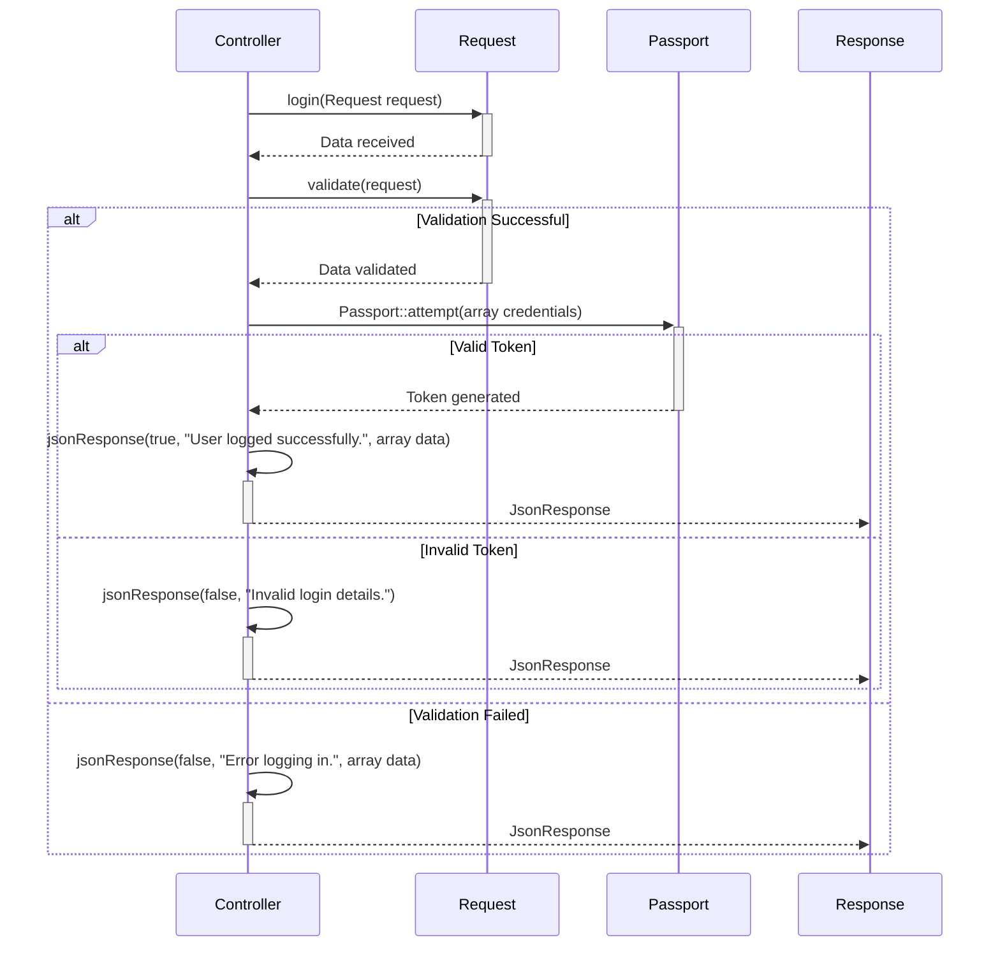

<hr>

### Logout

|ENDPOINT: | /api/logout |
|-|-|


|SALIDA:|
|-|

| Tipo      |	Descripción                       |
|-----------|-------------------------------------|
| Datos     |	Confirmación de sesión terminada  |

|Diagrama de Secuencia:|
|-|

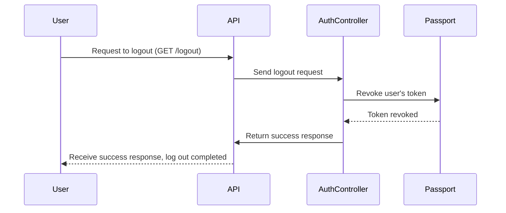
<hr>


## Diagrama Entidad Relación
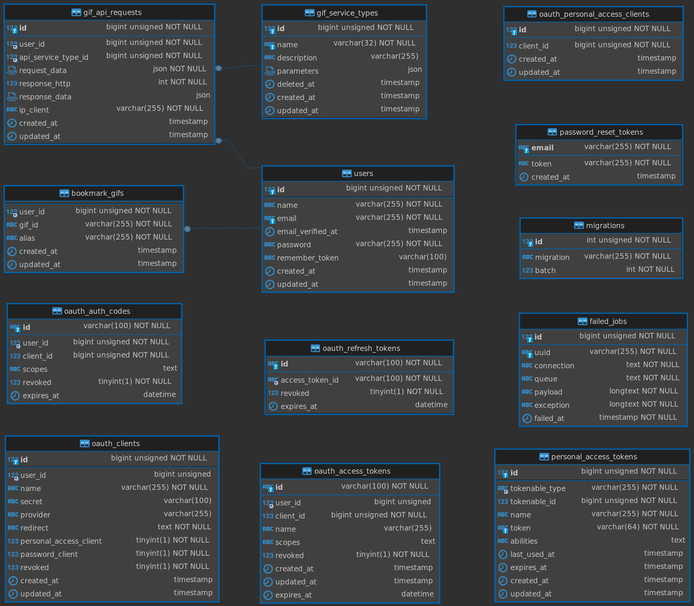


## Apagar el Entorno
Para apagar el entorno de desarrollo, ejecuta:
```bash
sail down
```

<p align="center"><a href="https://laravel.com" target="_blank"></a></p>


